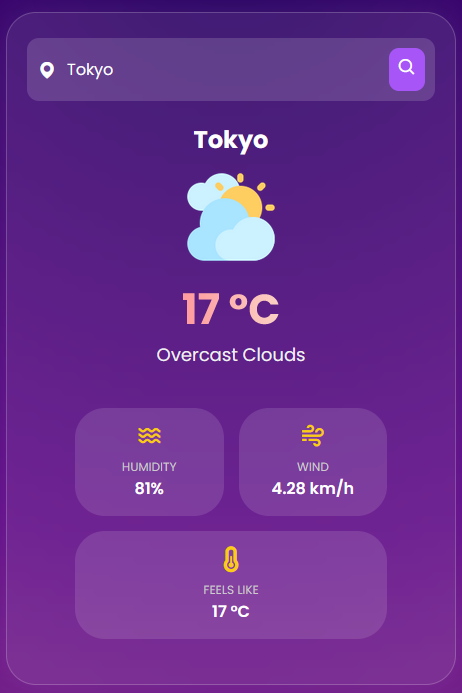

1. Project Title
Weather App- Real Time Weather Forecast

2. Objective
To create a responsive and interactive web application that allows users to check real-time weather conditions for any city using an API. The app displays temperature, weather conditions, humidity, wind speed, and a forecast overview in a modern, user-friendly interface.

3. How It Works
- Users enter a city name into the search box.
- The app fetches real-time weather data from an API (like OpenWeatherMap) using JavaScript.
- If the city is found:
- It displays the city name, temperature, weather condition, icon, humidity, wind speed, and "feels like" temperature.
- A forecast (if implemented) is shown below the current weather.
- If the city is not found:
- A "City not found!" message is shown

Screenshots

